# 📊 SIOP Insights

<div align="center">

### **Turning Sales, Forecast & Operational Data into Actionable Business Insights**

<br/>

[](#-technology-stack)
[](#-data-source)
[](#-technology-stack)
[](#-data-transformation)

<br/>


<br/>

</div>

---

## 🌟 Project Overview

**SIOP Insights** is an end-to-end **Business Intelligence and Analytics project** developed around a **Sales, Inventory and Operations Planning (SIOP)** case study.

The project transforms raw business data into meaningful, decision-ready insights through a structured analytics workflow.

The complete process includes:

> **Data Validation → Data Transformation → Data Modeling → KPI Development → Dashboard Design → Business Insights**

The final solution is delivered through an **interactive Power BI dashboard** that enables stakeholders to analyze forecast performance, actual sales trends, product performance, regional performance, and operational planning metrics.

---

## 🎯 Project Objectives

The main objective of this project is to support **data-driven business decision-making** by converting raw SIOP data into clear and actionable insights.

### The project focuses on:

* 🔍 Identifying data quality issues
* 🧹 Cleaning and transforming raw business data
* 🧩 Building a structured dimensional data model
* 📐 Creating analytical measures using DAX
* 📊 Designing interactive Power BI dashboards
* 🎯 Measuring forecast accuracy and forecast bias
* 📈 Analyzing monthly performance trends
* 🏷️ Comparing product-level performance
* 🌍 Evaluating regional performance
* 💡 Generating insights that support planning and operations

---

# 🔄 Project Workflow

```mermaid
flowchart LR

A[📂 Raw Excel Data]
--> B[🔍 Data Validation]

B
--> C[🧹 Data Cleaning]

C
--> D[⚙️ Power Query Transformation]

D
--> E[🧩 Dimensional Data Model]

E
--> F[📐 DAX Measures & KPIs]

F
--> G[📊 Interactive Power BI Dashboard]

G
--> H[💡 Business Insights]

style A fill:#E8F1FF
style B fill:#FFF4CC
style C fill:#DFF7E3
style D fill:#E8F1FF
style E fill:#F3E8FF
style F fill:#FFE8E8
style G fill:#FFF4CC
style H fill:#DFF7E3
```



---

# 🏗️ SIOP Analytics Architecture

The project follows a structured Business Intelligence architecture.

```text
                        ┌─────────────────────┐
                        │   RAW DATA SOURCE   │
                        │    Excel (.xlsb)    │
                        └──────────┬──────────┘
                                   │
                                   ▼
                        ┌─────────────────────┐
                        │   DATA VALIDATION   │
                        │                     │
                        │ • Completeness      │
                        │ • Consistency       │
                        │ • Accuracy          │
                        └──────────┬──────────┘
                                   │
                                   ▼
                        ┌─────────────────────┐
                        │  POWER QUERY (M)    │
                        │                     │
                        │ • Cleaning          │
                        │ • Transformation   │
                        │ • Standardization  │
                        └──────────┬──────────┘
                                   │
                                   ▼
                        ┌─────────────────────┐
                        │ DIMENSIONAL MODEL   │
                        │                     │
                        │ Facts + Dimensions  │
                        │ Relationships       │
                        └──────────┬──────────┘
                                   │
                                   ▼
                        ┌─────────────────────┐
                        │    DAX + KPIs       │
                        │                     │
                        │ Forecast Analysis   │
                        │ Variance Analysis   │
                        └──────────┬──────────┘
                                   │
                                   ▼
                        ┌─────────────────────┐
                        │  POWER BI DASHBOARD │
                        │                     │
                        │ Interactive Insights│
                        └─────────────────────┘
```

---

# 📂 Repository Structure

```text
SIOP-Insights/
│
├── 📊 CaseStudy2_SIOP_Dataset.xlsb
│   └── Raw dataset used for analysis
│
├── 📈 SIOP_Reporting_Lovesh.pbix
│   └── Complete interactive Power BI dashboard
│
├── 📑 CaseStudy2_Submission_Report.pdf
│   └── Detailed project analysis and methodology
│
├── 🖼️ Dashboard_Screenshots.pdf
│   └── Visual snapshots of the dashboard
│
├── ✅ Validation_Checklist.pdf
│   └── Data validation and quality checks
│
└── 📖 README.md
    └── Project documentation
```

---

# 📊 Dashboard Overview

The Power BI dashboard provides an interactive view of the SIOP process and allows users to explore business performance across multiple dimensions.

### The dashboard helps answer questions such as:

> 📌 How accurate are our forecasts?

> 📌 Are actual quantities higher or lower than forecasted quantities?

> 📌 Which products are performing better or worse?

> 📌 How does performance change over time?

> 📌 Are certain regions showing significant variance?

> 📌 Where should business teams focus their planning efforts?

The dashboard is designed to make complex business data **easy to understand, filter, compare, and explore**.

---

# 🎯 Key KPIs

The following business metrics are implemented in the Power BI solution.

| 📊 KPI                   | 📝 Description                                              |
| ------------------------ | ----------------------------------------------------------- |
| **Forecast Quantity**    | Expected or planned quantity for a given period             |
| **Actual Quantity**      | Actual observed sales or business quantity                  |
| **Forecast Accuracy**    | Measures how closely forecasts match actual performance     |
| **Forecast Bias**        | Identifies systematic over-forecasting or under-forecasting |
| **Variance**             | Difference between forecasted and actual values             |
| **Monthly Trends**       | Tracks performance changes over time                        |
| **Product Performance**  | Compares performance across products                        |
| **Regional Performance** | Analyzes differences across geographical regions            |

---

# 📐 KPI Logic

### 📊 Forecast Variance

```text
Variance = Actual Quantity − Forecast Quantity
```

A positive or negative variance helps identify whether actual performance exceeded or fell below the expected forecast.

---

### 🎯 Forecast Accuracy

Forecast accuracy measures the closeness between forecasted and actual values.

```text
Higher Accuracy
        ↓
Better Forecast Reliability
        ↓
Improved Planning & Decision-Making
```

---

### ⚖️ Forecast Bias

Forecast bias helps identify systematic forecasting patterns.

```text
Positive Bias
    ↓
Potential Over-Forecasting

Negative Bias
    ↓
Potential Under-Forecasting
```

Understanding forecast bias is important because repeated overestimation or underestimation can impact:

* 📦 Inventory Planning
* 💰 Working Capital
* 🚚 Supply Chain Operations
* 🏭 Production Planning
* 📈 Business Forecasting

---

# 🔍 Data Validation

Before building the dashboard, the dataset is evaluated to ensure reliability and consistency.

### Validation checks include:

* [x] Checking for missing values
* [x] Identifying inconsistent records
* [x] Verifying data completeness
* [x] Checking relationships between datasets
* [x] Validating important business fields
* [x] Reviewing calculation logic
* [x] Ensuring data consistency before modeling

📄 Detailed validation information is available in:

```text
Validation_Checklist.pdf
```

---

# 🧹 Data Transformation

Raw business data is transformed using **Power Query**.

The transformation process helps prepare the dataset for reliable analysis and reporting.

### Key transformation activities:

```text
Raw Data
   │
   ▼
Remove Errors & Inconsistencies
   │
   ▼
Handle Missing Values
   │
   ▼
Standardize Data Formats
   │
   ▼
Transform Columns
   │
   ▼
Prepare Analytical Tables
   │
   ▼
Load into Power BI Data Model
```

---

# 🧩 Data Modeling

The project uses a structured **dimensional data model** to support efficient reporting and analysis.

The model organizes data into:

### 📦 Fact Tables

Contain measurable business events and metrics such as:

* Forecast quantities
* Actual quantities
* Sales-related values
* Variance metrics

### 🗂️ Dimension Tables

Provide contextual information for analysis, such as:

* Time
* Product
* Region
* Other business categories

This structure enables flexible filtering and slicing of business performance.

```text
                  ┌──────────────┐
                  │     DATE     │
                  └──────┬───────┘
                         │
                         ▼
┌──────────────┐    ┌──────────────┐    ┌──────────────┐
│   PRODUCT    │───▶│   FACT DATA  │◀───│    REGION    │
└──────────────┘    └──────────────┘    └──────────────┘
                         │
                         ▼
                  ┌──────────────┐
                  │ BUSINESS KPIs│
                  └──────────────┘
```

---

# 📐 DAX Analytics

**DAX (Data Analysis Expressions)** is used to create analytical measures and business KPIs.

The measures support calculations related to:

* 📊 Forecast Quantity
* 📈 Actual Quantity
* 🎯 Forecast Accuracy
* ⚖️ Forecast Bias
* 📉 Variance
* 📅 Monthly Trends
* 🏷️ Product Analysis
* 🌍 Regional Analysis

These measures dynamically respond to dashboard filters and user interactions.

---

# 🖱️ Interactive Dashboard Experience

The Power BI dashboard is designed for exploration.

Users can interact with the data through:

✨ Dynamic filtering

📅 Time-based analysis

🏷️ Product-level exploration

🌍 Regional comparisons

📊 Interactive charts

🔄 Cross-filtering between visuals

📈 Trend analysis

This allows users to move from a **high-level business overview** to more detailed analysis.

---

# 🛠️ Technology Stack

<div align="center">

| Technology                                                                                                        | Purpose                                   |
| ----------------------------------------------------------------------------------------------------------------- | ----------------------------------------- |
|       | Interactive dashboard development         |
|  | Data cleaning and transformation          |
|              | KPI and analytical calculations           |
|    | Raw data source                           |
|            | Version control and project documentation |

</div>

---

# 💼 Business Value

The solution provides a centralized analytical view that can help stakeholders:

### 🎯 Improve Forecasting

Compare forecasts with actual outcomes and identify areas of poor forecast performance.

### 📦 Support Inventory Planning

Better forecasts can reduce risks associated with excess inventory or stock shortages.

### 📈 Identify Performance Trends

Analyze monthly, product-level, and regional trends.

### 🔎 Detect Variance

Quickly identify significant differences between planned and actual performance.

### 🧠 Enable Data-Driven Decisions

Transform raw data into visual insights that are easier for decision-makers to understand.

---

# 🚀 Getting Started

## 1️⃣ Clone the Repository

```bash
git clone https://github.com/chittoralovesh/SIOP-Insights.git
```

```bash
cd SIOP-Insights
```

---

## 2️⃣ Install Power BI Desktop

Download and install **Microsoft Power BI Desktop**.

---

## 3️⃣ Open the Dashboard

Open the following file:

```text
SIOP_Reporting_Lovesh.pbix
```

---

## 4️⃣ Refresh the Dataset

If Power BI asks for the dataset location:

```text
Update the data source path
        ↓
Select CaseStudy2_SIOP_Dataset.xlsb
        ↓
Refresh the Power BI model
```

---

# 📸 Dashboard Screenshots

Dashboard screenshots and visual previews are available in:

```text
Dashboard_Screenshots.pdf
```

### Suggested GitHub Preview

You can also add exported dashboard images to an `assets/` folder.

```text
assets/
├── dashboard-overview.png
├── forecast-analysis.png
├── product-analysis.png
└── regional-analysis.png
```

Then display them directly in the README:

```markdown
<p align="center">
  
</p>
```

> 💡 Adding actual dashboard images here will make the repository significantly more visual and impressive.

---

# 📑 Project Deliverables

| Deliverable               | Description                               |
| ------------------------- | ----------------------------------------- |
| 📊 Power BI Dashboard     | Interactive SIOP reporting and analysis   |
| 📂 Excel Dataset          | Source data used for analysis             |
| 📑 Submission Report      | Complete project methodology and findings |
| 🖼️ Dashboard Screenshots | Visual representation of dashboard pages  |
| ✅ Validation Checklist    | Data quality and validation documentation |

---

# 🧠 Skills Demonstrated

```text
Business Intelligence       ████████████████████
Data Analytics              ████████████████████
Power BI                    ████████████████████
Data Transformation         ███████████████████░
Data Modeling               ███████████████████░
DAX Development             ███████████████████░
Data Validation             ██████████████████░░
KPI Development             ███████████████████░
Data Visualization          ████████████████████
Business Reporting          ███████████████████░
```

### Core Skills

* Business Intelligence
* Power BI Development
* Data Analytics
* Data Validation
* Power Query
* DAX
* Dimensional Data Modeling
* KPI Development
* Data Visualization
* Forecast Analysis
* Variance Analysis
* Business Reporting

---

# 🔮 Potential Enhancements

The project can be extended with additional capabilities such as:

* [ ] Automated data refresh
* [ ] Power BI Service deployment
* [ ] Advanced forecasting models
* [ ] Machine Learning-based demand prediction
* [ ] Inventory optimization
* [ ] Automated anomaly detection
* [ ] Drill-through analysis
* [ ] Role-based dashboard access
* [ ] Real-time data integration
* [ ] Executive summary dashboard

---

# 🎓 Learning Outcomes

Through this project, the following concepts were applied:

```text
Business Problem
      ↓
Data Understanding
      ↓
Data Validation
      ↓
Data Transformation
      ↓
Data Modeling
      ↓
DAX Calculations
      ↓
Dashboard Development
      ↓
Business Insights
      ↓
Data-Driven Decision Making
```

This project demonstrates the complete lifecycle of transforming raw business data into a structured analytical solution.

---

# 👨‍💻 Author

<div align="center">

## Lovesh Chittora

<br/>

<a href="https://github.com/chittoralovesh">

</a>

<a href="https://www.linkedin.com/in/lovesh-chittora/">

</a>

</div>

---

# ⭐ Support the Project

If you found this project useful or interesting:

<div align="center">

### ⭐ Star the repository

### 🍴 Fork it

### 💬 Share your feedback

<br/>


</div>

---

<div align="center">

## 🚀 From Raw Data to Business Decisions

### **Validate. Transform. Model. Analyze. Visualize.**

<br/>


<br/>

**© 2026 Lovesh Chittora**

</div>
